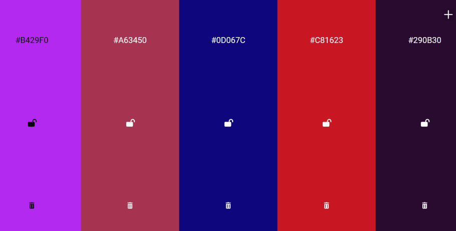

# Подбор цвета

Нажми пробел чтобы поменять цвета.

Зафиксируй понравившиеся с помощью замочка.

Чтобы скопировать значение, просто кликни на код понравившегося цвета.

Можешь поделиться с кем-либо ссылкой - он увидет те цвета, которые ты подобрал.

## Технологии:
* React

## Посмотреть проект

* Посмотреть проект можно тут &emsp; [&rsaquo; клик &lsaquo;](https://andreikolosov.github.io/color_match/)

### Автор
* Колосов Андрей [&rsaquo; GitHub &lsaquo;](https://github.com/AndreiKolosov)
